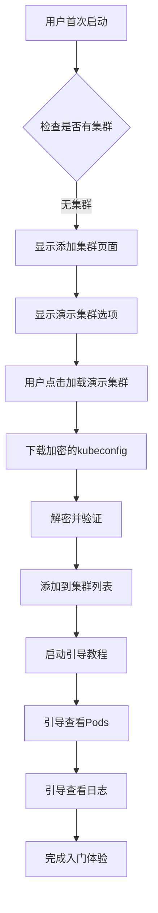
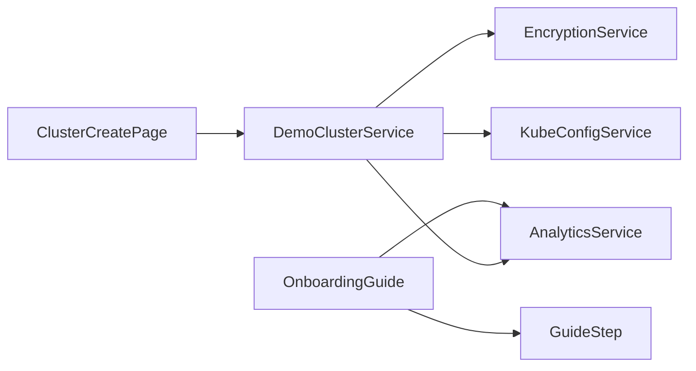

# 设计文档

## 概述

演示集群入门功能旨在为新用户提供30秒内的"惊喜时刻"体验。该功能通过在用户首次安装且没有任何集群时，在"添加集群"页面提供"加载演示集群"选项，让用户能够快速体验应用的核心功能。

## 架构

### 高层架构



### 组件架构



## 组件和接口

### 1. DemoClusterService

负责演示集群的下载、解密和配置管理。

```dart
class DemoClusterService {
  static const String READONLY_DEMO_URL = 'https://static.k8z.dev/k8z-demo/kubeconfig';
  // 公钥在编译时通过环境变量或构建脚本注入
  static String get embeddedPublicKey => const String.fromEnvironment('DEMO_PUBLIC_KEY');
  
  Future<K8zCluster> loadDemoCluster();
  Future<String> downloadEncryptedConfig();
  Future<String> decryptConfig(String encryptedData);
  Future<K8zCluster> createDemoCluster(String kubeconfig);
}
```

### 2. OnboardingGuideService

管理引导教程的流程和状态。

```dart
class OnboardingGuideService {
  Future<void> startGuide(K8zCluster cluster);
  Future<void> showPodListGuide();
  Future<void> showLogViewGuide();
  Future<void> completeGuide();
  bool isGuideActive();
}
```

### 3. GuideOverlay Widget

显示引导提示的覆盖层组件。

```dart
class GuideOverlay extends StatefulWidget {
  final Widget child;
  final GuideStep currentStep;
  final VoidCallback onNext;
  final VoidCallback onSkip;
}
```

### 4. DemoClusterIndicator Widget

在集群列表中标识演示集群的组件。

```dart
class DemoClusterIndicator extends StatelessWidget {
  final bool isDemo;
  final bool isReadOnly;
}
```

## 数据模型

### 1. K8zCluster 扩展

为现有的 K8zCluster 模型添加演示集群标识：

```dart
class K8zCluster {
  // 现有字段...
  final bool isDemo;
  final bool isReadOnly;
  
  // 构造函数和方法...
  factory K8zCluster.createDemo(String kubeconfig) {
    return K8zCluster(
      // 基本配置...
      isDemo: true,
      isReadOnly: true,
    );
  }
}
```

### 2. GuideStep 枚举

定义引导教程的步骤：

```dart
enum GuideStep {
  welcome,
  podList,
  podLogs,
  additionalFeatures,
  completed,
}
```

### 3. OnboardingState

管理入门流程的状态：

```dart
class OnboardingState {
  final bool isActive;
  final GuideStep currentStep;
  final K8zCluster? demoCluster;
  final DateTime? startTime;
  final Map<String, dynamic> analytics;
}
```

## 错误处理

### 1. 网络错误处理

```dart
class DemoClusterException implements Exception {
  final String message;
  final DemoClusterErrorType type;
  
  const DemoClusterException(this.message, this.type);
}

enum DemoClusterErrorType {
  networkError,
  decryptionError,
  validationError,
  configurationError,
}
```

### 2. 降级策略

- **网络失败**: 使用本地内嵌的演示配置
- **解密失败**: 显示错误消息并提供手动添加集群选项
- **验证失败**: 记录错误并回退到常规入门流程

### 3. 用户友好的错误消息

```dart
class ErrorMessageProvider {
  static String getLocalizedMessage(
    BuildContext context, 
    DemoClusterException error
  ) {
    final lang = S.of(context);
    switch (error.type) {
      case DemoClusterErrorType.networkError:
        return lang.demo_cluster_network_error;
      case DemoClusterErrorType.decryptionError:
        return lang.demo_cluster_decrypt_error;
      // 其他错误类型...
    }
  }
}
```

## 测试策略

### 1. 单元测试

- **DemoClusterService**: 测试下载、解密、验证逻辑
- **OnboardingGuideService**: 测试引导流程状态管理
- **EncryptionService**: 测试加密解密功能
- **AnalyticsService**: 测试事件记录

### 2. 集成测试

- **完整入门流程**: 从无集群状态到完成引导的端到端测试
- **网络错误场景**: 测试网络失败时的降级行为
- **解密错误场景**: 测试解密失败时的错误处理

### 3. Widget 测试

- **ClusterCreatePage**: 测试演示集群选项的显示
- **GuideOverlay**: 测试引导覆盖层的交互
- **DemoClusterIndicator**: 测试演示集群标识的显示

### 4. 性能测试

- **30秒目标**: 验证从点击到完成引导在30秒内
- **下载性能**: 测试kubeconfig下载速度
- **UI响应性**: 确保引导过程中UI保持响应

## 安全考虑

### 1. 加密和解密

- 使用RSA公钥加密确保演示配置的完整性
- 公钥在编译时通过环境变量安全注入，不提交到代码仓库
- 验证下载内容的数字签名

构建时公钥注入示例：
```bash
# 构建时设置环境变量
flutter build apk --dart-define=DEMO_PUBLIC_KEY="$(cat demo_public_key.pem)"
```

### 2. 网络安全

- 使用HTTPS确保传输安全
- 实施证书固定防止中间人攻击
- 设置合理的超时和重试机制

### 3. 数据隔离

- 演示集群数据与用户数据完全隔离
- 只读权限确保不会影响演示环境
- 清楚标识演示数据，防止用户混淆

## 国际化支持

### 1. 多语言文本

需要添加的本地化字符串：

```dart
// lib/l10n/intl_zh_CN.arb
{
  "load_demo_cluster": "加载演示集群",
  "demo_cluster_loading": "正在加载演示集群...",
  "demo_cluster_loaded": "演示集群已加载",
  "demo_cluster_indicator": "演示",
  "readonly_indicator": "只读",
  "guide_welcome": "欢迎使用 K8zDev！让我们开始探索吧。",
  "guide_pod_list": "这里显示了集群中的所有 Pod。点击任意 Pod 查看详情。",
  "guide_pod_logs": "您可以在这里查看 Pod 的实时日志。",
  "guide_complete": "太棒了！您已经了解了基本功能。",
  "demo_cluster_network_error": "无法连接到演示服务器，将使用离线演示。",
  "demo_cluster_decrypt_error": "演示配置解密失败，请稍后重试。"
}
```

### 2. 引导文本本地化

引导教程的所有文本都需要支持多语言，包括：
- 欢迎消息
- 步骤说明
- 按钮文本
- 错误消息

## 分析和监控

### 1. 关键指标

- **加载成功率**: 演示集群成功加载的比例
- **完成率**: 用户完成引导教程的比例
- **30秒达成率**: 在30秒内完成体验的用户比例
- **转换率**: 从演示转向添加真实集群的用户比例

### 2. 事件跟踪

使用现有的 Google Analytics 服务上报事件：

```dart
class OnboardingAnalytics {
  static void trackDemoClusterLoad(DateTime startTime) {
    AnalyticsService.logEvent(
      name: 'demo_cluster_load_start',
      parameters: {
        'timestamp': startTime.millisecondsSinceEpoch,
      },
    );
  }
  
  static void trackGuideStepComplete(GuideStep step, Duration elapsed) {
    AnalyticsService.logEvent(
      name: 'onboarding_guide_step_complete',
      parameters: {
        'step': step.name,
        'elapsed_ms': elapsed.inMilliseconds,
      },
    );
  }
  
  static void trackGuideComplete(Duration totalTime) {
    AnalyticsService.logEvent(
      name: 'onboarding_guide_complete',
      parameters: {
        'total_time_ms': totalTime.inMilliseconds,
        'achieved_30s_goal': totalTime.inSeconds <= 30,
      },
    );
  }
  
  static void trackConversion(String conversionType) {
    AnalyticsService.logEvent(
      name: 'demo_to_real_cluster_conversion',
      parameters: {
        'conversion_type': conversionType,
      },
    );
  }
  
  static void trackError(DemoClusterException error) {
    AnalyticsService.logEvent(
      name: 'demo_cluster_error',
      parameters: {
        'error_type': error.type.name,
        'error_message': error.message,
      },
    );
  }
}
```

### 3. 性能监控

- 下载时间监控
- 解密时间监控
- UI渲染性能监控
- 内存使用监控

## 实现优先级

### 第一阶段：核心功能
1. DemoClusterService 基础实现
2. ClusterCreatePage 演示选项集成
3. 基础的引导覆盖层

### 第二阶段：用户体验
1. 完整的引导教程流程
2. 错误处理和降级策略
3. 演示集群标识和只读限制

### 第三阶段：优化和监控
1. 性能优化
2. 分析事件集成
3. 国际化完善

## 技术债务和未来改进

### 1. 配置管理
- 考虑使用远程配置管理演示集群URL
- 支持多个演示环境（开发、测试、生产）

### 2. 个性化体验
- 根据用户偏好定制引导内容
- 支持跳过已知功能的引导

### 3. 高级分析
- 用户行为热图
- A/B测试框架集成
- 更详细的用户旅程分析