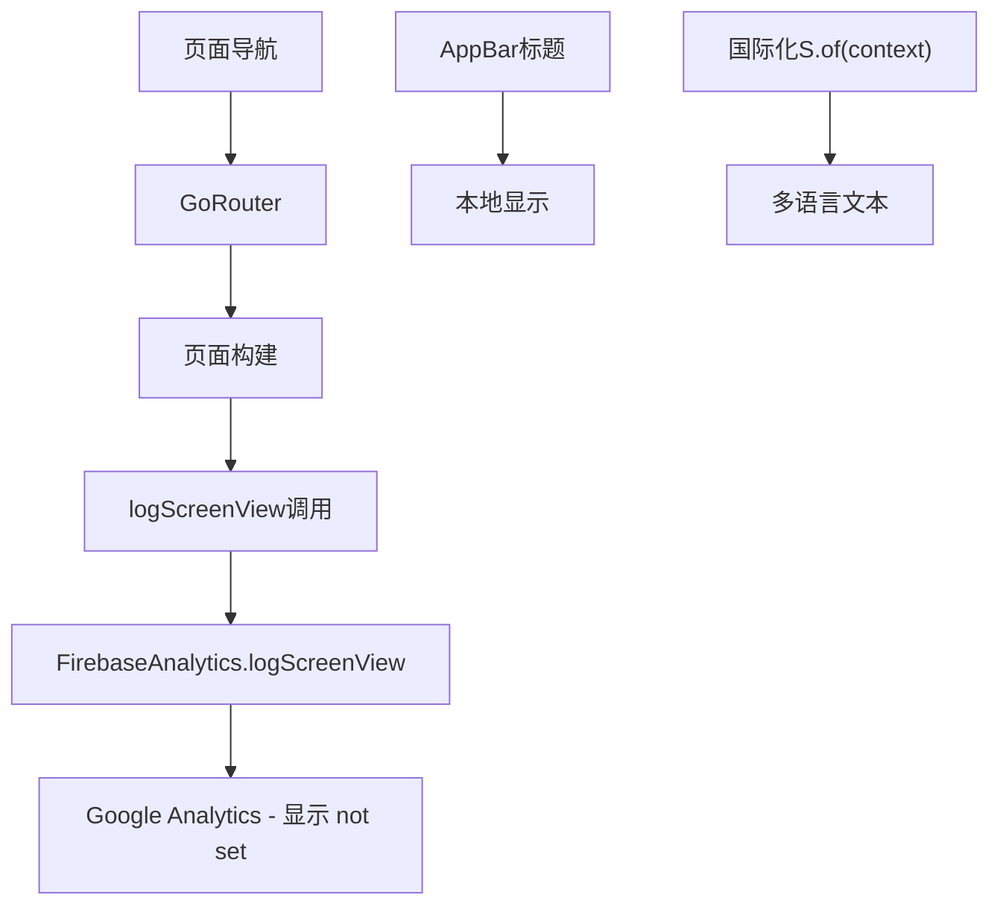
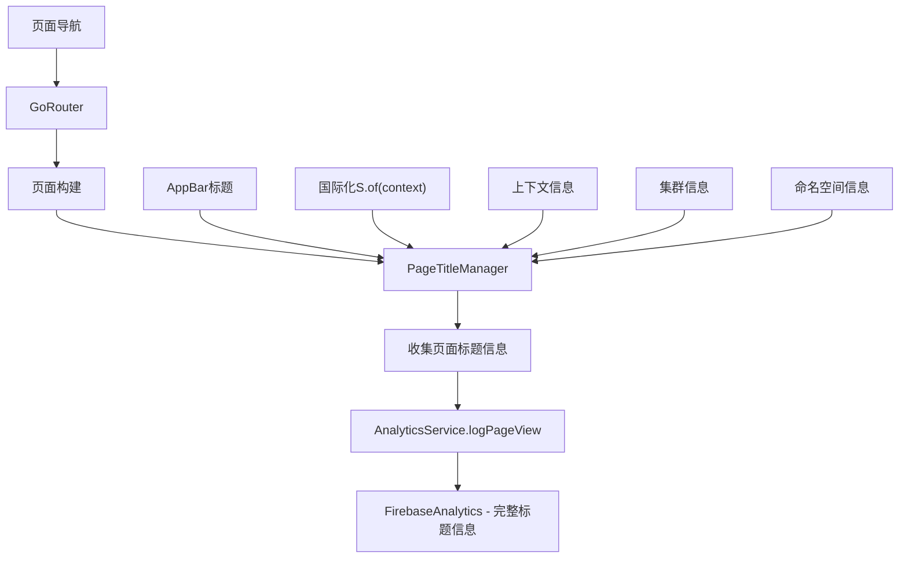

# Google Analytics 页面标题修复设计文档

## 概述

本设计文档旨在解决当前 Google Analytics 埋点中页面标题显示为 "(not set)" 的问题。通过分析现有代码结构，我们发现问题的根本原因是：

1. 当前的 `logScreenView` 函数只传递了 `screenName` 参数，但没有设置页面标题
2. Flutter 应用使用 `go_router` 进行路由管理，但没有与 Analytics 的页面标题同步
3. 应用支持多语言，但 Analytics 事件中没有包含语言上下文信息
4. 页面标题缺乏上下文信息（如集群名称、命名空间等）

## 架构

### 当前架构分析



### 目标架构



## 组件和接口

### 1. PageTitleManager (页面标题管理器)

负责统一管理页面标题的生成和格式化。

```dart
class PageTitleManager {
  static String generatePageTitle({
    required BuildContext context,
    required String screenName,
    String? customTitle,
    Map<String, String>? contextInfo,
  });
  
  static Map<String, Object> generateAnalyticsParameters({
    required String pageTitle,
    required String screenName,
    required String routePath,
    String? language,
    Map<String, String>? contextInfo,
  });
}
```

### 2. AnalyticsService (增强的分析服务)

替换现有的 `logScreenView` 函数，提供更丰富的页面追踪功能。

```dart
class AnalyticsService {
  static Future<void> logPageView({
    required BuildContext context,
    required String screenName,
    String? customTitle,
    Map<String, String>? contextInfo,
  });
  
  static Future<void> logScreenTransition({
    required String fromScreen,
    required String toScreen,
    Map<String, Object>? additionalParams,
  });
}
```

### 3. RouteObserver (路由观察器)

监听路由变化，自动触发页面标题更新和 Analytics 事件。

```dart
class AnalyticsRouteObserver extends NavigatorObserver {
  @override
  void didPush(Route<dynamic> route, Route<dynamic>? previousRoute);
  
  @override
  void didPop(Route<dynamic> route, Route<dynamic>? previousRoute);
  
  @override
  void didReplace({Route<dynamic>? newRoute, Route<dynamic>? oldRoute});
}
```

### 4. ContextInfoProvider (上下文信息提供器)

提供页面相关的上下文信息，如当前集群、命名空间等。

```dart
class ContextInfoProvider {
  static Map<String, String> getCurrentContext(BuildContext context);
  static String? getCurrentClusterName();
  static String? getCurrentNamespace();
  static String getCurrentLanguage(BuildContext context);
}
```

## 数据模型

### PageTitleInfo

```dart
class PageTitleInfo {
  final String screenName;
  final String displayTitle;
  final String routePath;
  final String language;
  final Map<String, String> contextInfo;
  final DateTime timestamp;
  
  const PageTitleInfo({
    required this.screenName,
    required this.displayTitle,
    required this.routePath,
    required this.language,
    required this.contextInfo,
    required this.timestamp,
  });
}
```

### AnalyticsEvent

```dart
class AnalyticsEvent {
  final String eventName;
  final String pageTitle;
  final String screenName;
  final String routePath;
  final Map<String, Object> parameters;
  
  const AnalyticsEvent({
    required this.eventName,
    required this.pageTitle,
    required this.screenName,
    required this.routePath,
    required this.parameters,
  });
}
```

## 错误处理

### 1. 标题生成失败处理

- 当国际化文本获取失败时，使用英文默认标题
- 当上下文信息获取失败时，使用基础页面名称
- 记录错误日志但不影响用户体验

### 2. Analytics 上报失败处理

- 实现重试机制，最多重试 3 次
- 失败时记录到本地日志
- 提供离线缓存机制，网络恢复后批量上报

### 3. 内存泄漏防护

- 使用弱引用避免 Context 泄漏
- 及时清理路由观察器
- 限制缓存的事件数量

## 测试策略

### 1. 单元测试

- `PageTitleManager` 的标题生成逻辑
- `AnalyticsService` 的事件参数构建
- `ContextInfoProvider` 的上下文信息提取

### 2. 集成测试

- 路由导航时的 Analytics 事件触发
- 多语言切换时的标题更新
- 集群切换时的上下文信息更新

### 3. 端到端测试

- 完整的用户导航流程
- Analytics 数据在 Google Analytics 控制台的显示
- 不同设备和平台的兼容性

## 实现细节

### 1. 页面标题格式规范

```
基础格式: [应用名] - [页面名称]
带上下文: [应用名] - [页面名称] - [集群名称]
带命名空间: [应用名] - [页面名称] - [集群名称]/[命名空间]
资源详情: [应用名] - [资源类型] - [资源名称] - [集群名称]/[命名空间]
```

### 2. 多语言支持策略

- 优先使用当前语言的翻译文本
- 回退到英文作为默认语言
- 在 Analytics 参数中包含语言标识符

### 3. 性能优化

- 页面标题生成使用缓存机制
- Analytics 事件批量上报
- 异步处理避免阻塞 UI

### 4. 向后兼容性

- 保持现有 `logScreenView` 函数接口
- 新增功能通过可选参数实现
- 渐进式迁移现有代码

## 配置和部署

### 1. Firebase Analytics 配置

- 确保 `page_title` 参数正确映射
- 配置自定义维度用于上下文信息
- 设置事件过滤规则

### 2. 调试和监控

- 添加详细的日志记录
- 实现 Analytics 事件的本地验证
- 提供开发模式下的事件预览功能

### 3. 数据隐私

- 确保不记录敏感信息（如密钥、密码）
- 遵循 GDPR 和其他数据保护法规
- 提供用户选择退出 Analytics 的选项